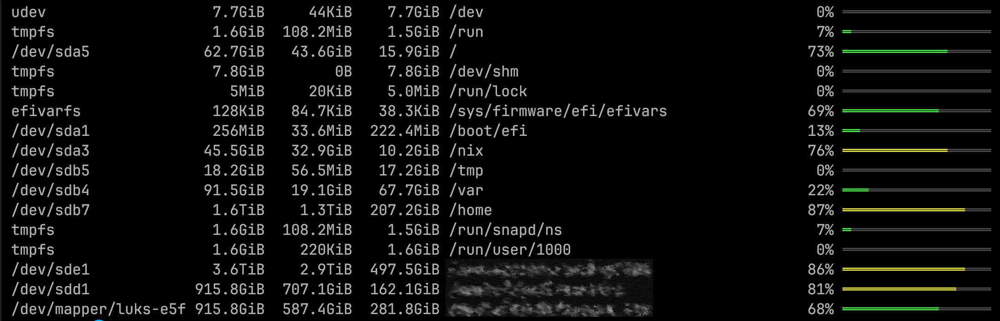

# ddf - Disk Space Usage Tool

`ddf` is a Rust-based clone of the `df` command, designed to display disk space usage information in a user-friendly format with customizable thresholds for medium and high disk usage. It supports excluding specific file systems or mount points and offers visual representation of disk space usage.

Disclaimer: The `Filesystem` struct and the related functions is borrowed from the [uutils coreutils](https://github.com/uutils/coreutils) project.

## Example Output

```bash
udev                  30.3GiB        0B   30.3GiB /dev                                      0% ═════════════════
tmpfs                  6.1GiB    2.4MiB    6.1GiB /run                                      0% ═════════════════
/dev/md3             436.5GiB  279.2GiB  135.1GiB /                                        67% ═════════════════
tmpfs                 30.3GiB        0B   30.3GiB /dev/shm                                  0% ═════════════════
tmpfs                    5MiB        0B      5MiB /run/lock                                 0% ═════════════════
/dev/md2             988.7MiB  116.9MiB  820.7MiB /boot                                    12% ═════════════════
/dev/md0             255.7MiB    160KiB  255.5MiB /boot/efi                                 0% ═════════════════
tmpfs                  6.1GiB        0B    6.1GiB /run/user/0                               0% ═════════════════
```




## Installation

You can install `ddf` via a Nix flake or build it from the source using Cargo.

### Using Nix Flake

```bash
nix build github:djedi23/ddf
```

### From Source

First, ensure you have Rust installed. Then clone the repository and use Cargo to build and install:

```bash
git clone https://github.com/djedi23/ddf.git
cd ddf
cargo install --path .
```

## Configuration

`ddf` can be configured using a TOML file located at `$HOME/.config/ddf/settings.toml`. Here's an example configuration:

```toml
[[exclude]]
mount_dir_starts_with="/snap/"
[[exclude]]
fstype="tmpfs"

[threshold]
medium=0.25
high=0.5
```

- **Excluding Mount Points**: You can exclude certain file systems or mount points from being displayed using the `exclude` section.
  - `mount_dir_starts_with`: Excludes all mounts that start with the specified directory path.
  - `fstype`: Excludes file systems of a certain type.
  
- **Usage Thresholds**: You can adjust the thresholds for medium and high disk usage:
  - `medium`: Disk usage above this percentage will be highlighted as medium.
  - `high`: Disk usage above this percentage will be highlighted as high.

## Usage

Basic usage of `ddf` is as follows:

```bash
ddf [OPTIONS] [FILES]...
```

### Arguments:
- `[FILES]...`: List of file systems or mount points to display (optional).

### Options:
- `--completion <COMPLETION>`: Generate shell completion scripts. Possible values: `bash`, `elvish`, `fish`, `powershell`, `zsh`.
- `-h, --help`: Print help information.
- `-V, --version`: Print version information.

## Example Commands

- Display disk space usage for all file systems:
  ```bash
  ddf
  ```
- Display usage for specific mount points:
  ```bash
  ddf / /home /boot
  ```

## License

This project is licensed under the MIT License. See the [LICENSE](LICENSE) file for details.
